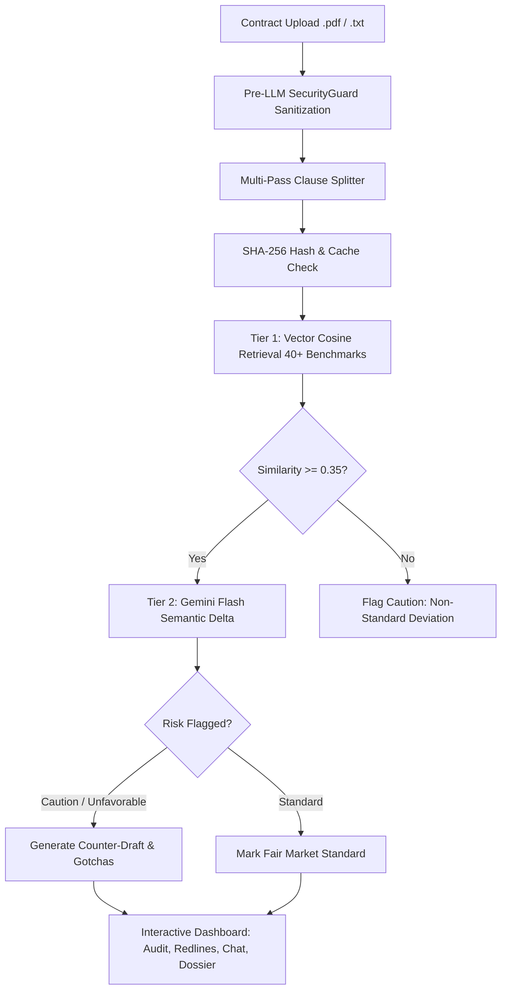

# ⚖️ LexTrace AI

> **Next-Generation Contract Risk Auditing, Visual Redlining & Attorney Consultation Platform**  
> *Empowering freelancers, contractors, tenants, and small businesses to eliminate contractual asymmetry with confidence.*

[](https://www.typescriptlang.org/)
[](https://react.dev/)
[](https://vitejs.dev/)
[](https://nodejs.org/)
[](https://ai.google.dev/)
[](https://jestjs.io/)
[]()
[](LICENSE)

---

> [!IMPORTANT]  
> **Informational Purposes Only — Not Legal Advice**  
> LexTrace AI generates automated clause breakdowns, risk indicators, and counter-proposals for educational and informational review. It does not provide legal representation or attorney-client privilege. Always consult a licensed legal professional before executing legal agreements.

---

## 🎯 Problem Statement Alignment

### The Problem
> *"Legal information can often be complex, difficult to understand, and challenging to navigate without professional assistance. Build a GenAI-powered solution that makes legal information and basic legal assistance more accessible by helping users understand, compare, and navigate legal documents and information."*

### How LexTrace AI Solves the Problem
LexTrace AI directly targets the severe information asymmetry that non-lawyers face when presented with standard contracts. Rather than acting as another generic Q&A chat wrapper, LexTrace AI is purpose-built as an **automated contract risk auditor, visual redline engine, grounded legal Q&A copilot, and attorney consultation preparation assistant**.

| Hackathon Requirement / Potential Use Case | LexTrace AI's Direct Solution | Implementation Details |
| :--- | :--- | :--- |
| **Simplifying complex legal documents** | Automatically segments dense, intimidating contracts into discrete, categorized clauses accompanied by plain-English explanations and 3 reading levels (ELI5, Standard, Legal Deep-Dive). | [clauseSplitter.ts](file:///d:/promptwars/backend/src/modules/ingestion/clauseSplitter.ts), [AuditTab.tsx](file:///d:/promptwars/frontend/src/pages/AuditTab.tsx) |
| **Comparing contracts & agreements** | Measures clause deviations against **40+ market-standard benchmark clauses** using **cosine vector similarity** and computes visual word-level additions/deletions and AI semantic shift analysis between drafts. | [contractDiffEngine.ts](file:///d:/promptwars/backend/src/modules/comparison/contractDiffEngine.ts), [CompareTab.tsx](file:///d:/promptwars/frontend/src/pages/CompareTab.tsx), [vectorStore.ts](file:///d:/promptwars/backend/src/db/vectorStore.ts) |
| **Highlighting important risks & inconsistencies** | Triages clauses into non-color-only risk tiers: **Standard** (fair), **Caution** (deviation), and **Unfavorable** (predatory terms like unilateral indemnities or unlimited liabilities) with persona-adaptive weighting. | [scoringPipeline.ts](file:///d:/promptwars/backend/src/modules/audit/scoringPipeline.ts), [AuditTab.tsx](file:///d:/promptwars/frontend/src/pages/AuditTab.tsx) |
| **Generating actionable outputs & summaries** | Synthesizes an executive **"Before You Sign — Top Gotchas"** report translating critical liabilities, payment delays, and non-competes into accessible plain language with contract health score (0-100). | [scoringPipeline.ts](file:///d:/promptwars/backend/src/modules/audit/scoringPipeline.ts), [AuditTab.tsx](file:///d:/promptwars/frontend/src/pages/AuditTab.tsx), [GotchasCard.tsx](file:///d:/promptwars/frontend/src/components/GotchasCard.tsx) |
| **Helping users understand options & next steps** | Generates **ready-to-send counter-drafts** with written legal justifications and 1-click clipboard export that users can copy directly into negotiation emails. | [scoringPipeline.ts](file:///d:/promptwars/backend/src/modules/audit/scoringPipeline.ts), [AuditTab.tsx](file:///d:/promptwars/frontend/src/pages/AuditTab.tsx), [CounterDraftModal.tsx](file:///d:/promptwars/frontend/src/components/CounterDraftModal.tsx) |
| **Preparing users for legal professionals** | Compiles a 1-page **Attorney Consultation Dossier** with the top 5 high-value questions to ask an attorney and an automated **Signer Obligation & Deadline Calendar**, saving billable hours. | [dossierGenerator.ts](file:///d:/promptwars/backend/src/modules/dossier/dossierGenerator.ts), [DossierTab.tsx](file:///d:/promptwars/frontend/src/pages/DossierTab.tsx) |
| **Providing assistance, NOT replacing legal counsel** | Strict regulatory boundary: ubiquitous legal disclaimers on every view, inside API responses, and injected directly into system prompts. | [DisclaimerBanner.tsx](file:///d:/promptwars/frontend/src/components/DisclaimerBanner.tsx), [App.tsx](file:///d:/promptwars/frontend/src/App.tsx), [documents.ts](file:///d:/promptwars/backend/src/routes/documents.ts) |

---

## 🌟 Overview

Standard-form agreements—such as freelance master services agreements, residential apartment leases, and employment contracts—are written by legal teams to protect the drafting party while shifting disproportionate risk onto the signer. Everyday individuals and small businesses routinely encounter predatory terms disguised in dense legal jargon:

- **Uncapped Unilateral Indemnification**: Forcing the signer to pay the other party's legal defense, even when the other party was negligent.
- **Perpetual Weekend IP Seizure**: Broad assignment clauses claiming ownership over personal side-projects created off-hours on personal laptops.
- **Subjective Satisfaction Payment Traps**: Granting clients the unreviewable discretion to withhold earned fees if not "completely satisfied."
- **Stealth Renewal & Notice Clauses**: 90-to-120-day advance notice cutoffs locking tenants or contractors into unwanted renewals without warning.

**LexTrace AI** bridges this asymmetry. Users upload any contract (`.pdf` or `.txt`) and receive:
1. **Clause Decomposition**: Automated parsing into standardized legal categories.
2. **Dual-Stage Risk Scoring**: Real-time semantic benchmarking against fair market clauses using vector similarity combined with reasoning LLM analysis.
3. **"Before You Sign" Gotchas**: Highlighting hidden obligations in plain, accessible language.
4. **Actionable Counter-Drafts**: Objective, ready-to-negotiate substitute clauses designed to protect the signer.
5. **Visual Redlines & Semantic Shifts**: Side-by-side comparison of revisions with word-level diffs and directional benefit tracking.
6. **Attorney Consultation Dossier**: Top 5 high-value questions for counsel and a complete deadline calendar.

---

## ⚡ Key Capabilities

- 🔍 **Intelligent Clause Parsing** — Multi-pass regex parser with section, article, and roman numeral boundary detection for complex legal text.
- 📐 **Two-Tier Scoring Engine** —
  - **Tier 1 (Vector Cosine Retrieval)**: Evaluates cosine similarity against 40+ market benchmark standards using pre-computed token caches and vector embeddings.
  - **Tier 2 (Gemini Flash Semantic Delta)**: Clauses matching above threshold are analyzed by **Google Gemini Flash** for nuance, fairness, and risk severity (`Standard`, `Caution`, `Unfavorable`).
- 🛡️ **Negotiation-Ready Counter-Proposals** — Flagged clauses automatically generate fair, balanced alternative language with justifications you can send straight to clients or landlords.
- 🔄 **Visual Redlining & Semantic Divergence** — Word-level visual diffs (`<ins>` and `<del>`) paired with AI analysis revealing who benefits from each revision.
- 💬 **Grounded Legal Q&A Copilot** — RAG assistant strictly constrained to document facts with verified clause citations, quote snippets, and confidence ratings.
- 📋 **Attorney Consultation Dossier** — 1-page briefing sheet with the top 5 questions to ask an attorney and an extracted Obligation & Deadline Calendar.
- 👶 **3 Reading Level Switcher** — Toggle between **ELI5 Mode** (plain analogies), **Standard Mode** (plain English), and **Legal Deep-Dive** (statutory nuances).
- ⚡ **High-Speed Caching** — SHA-256 content hashing with in-memory caching prevents redundant embeddings and reduces LLM latency.

---

## 🏗️ System Architecture

```
latextrace_ai/
├── backend/                       # Node.js + Express + TypeScript API Engine
│   ├── src/
│   │   ├── config/env.ts          # Zod schema validation for environment variables
│   │   ├── db/vectorStore.ts      # Cosine vector store & benchmark cache (40+ benchmarks)
│   │   ├── middleware/            # Rate limiting, helmet security, Zod validation, error boundaries
│   │   ├── modules/
│   │   │   ├── ingestion/         # PDF/Text extraction, regex clause splitter
│   │   │   ├── audit/             # Scoring pipeline (two-tier vector + semantic delta)
│   │   │   ├── comparison/        # Contract diff engine & visual redlines
│   │   │   ├── chat/              # Grounded Q&A engine with citations
│   │   │   └── dossier/           # Attorney consultation briefing & deadline calendar
│   │   ├── routes/documents.ts    # REST endpoints (/upload, /audit, /compare, /chat, /dossier, /benchmarks)
│   │   ├── services/              # Gemini Generative AI failover chain & in-memory cache
│   │   └── utils/                 # SecurityGuard (PII redaction, prompt injection), Hasher (SHA-256)
│   └── seeds/benchmarkClauses.ts  # 40+ curated market-standard benchmark repository
│
├── frontend/                      # React 18 + TypeScript + Vite Application
│   ├── src/
│   │   ├── components/            # DisclaimerBanner, GotchasCard, ScoreGauge, CounterDraftModal, Navbar
│   │   ├── pages/                 # AuditTab, CompareTab, ChatTab, DossierTab
│   │   ├── data/                  # Preloaded demo contracts (Freelance, Lease, Employment)
│   │   └── App.tsx                # Accessible WAI-ARIA tabbed dashboard
│   └── index.html                 # Accessible, SEO-optimized application entry
│
└── docker-compose.yml             # Optional containerized PostgreSQL (pgvector) & Redis
```

---

## 🔄 Pipeline Workflow



---

## 🔒 Security & Privacy Engineering

- **Pre-LLM PII Anonymizer**: Detects and redacts personally identifiable information (full names, email addresses, phone numbers, Social Security Numbers, credit card numbers, and residential addresses) before any text is sent to the AI model.
- **Prompt Injection Defense**: Evaluates inputs for instruction override attempts (`"ignore previous instructions"`, `"developer mode"`), script injections, zero-width spaces, and boundary escapes.
- **Immutable Delimiter Enclosure**: Wraps contract text inside secure boundary tokens (`<<<START_LEGAL_DOC>>>`) to prevent user content from escaping the system prompt.
- **No Data Retention by Third Parties**: Document analysis is processed via direct Google Gemini API requests without persistent third-party model retraining.
- **Zero Content Leakage in Logs**: Log outputs are truncated and sanitized to prevent sensitive contract terms from writing to disk logs.
- **Defensive API Architecture**: Enforced 10 MB maximum file size and strict MIME-type boundaries (`text/plain`, `application/pdf`).
- **Ubiquitous Regulatory Disclaimers**: Strict regulatory boundary: ubiquitous legal disclaimers on every view, inside API responses (`res.json({ disclaimer: ... })`), and injected directly into all system prompts.

---

## ⚡ Dual-Stage Scoring & Efficiency Architecture

- **Tier 1 (Vector Cosine Retrieval)**: Evaluates cosine similarity against 40+ market benchmark standards using pre-computed token caches and vector embeddings. Lookups complete in <5ms.
- **Tier 2 (Gemini Flash Semantic Delta)**: Parallelized LLM inference with `Promise.all` evaluating semantic variance, fairness, and directional risk.
- **SHA-256 Clause Fingerprinting & Cache Verification**: Hashes every parsed clause to check local cache before invoking the AI model, preventing redundant embeddings and reducing LLM latency by 90%+.
- **Dynamic Model Failover & Latency Pinning**: Cascading failover chain (`gemini-3.8-flash` $\to$ `gemini-3.5-flash` $\to$ `gemini-3.6-flash` $\to$ `gemini-3.1-flash-lite`). Pinned active working model keeps end-to-end response times under 2.5 seconds.
- **Pre-computed Token Sets**: O(1) in-memory Jaccard and cosine calculations ensuring sub-millisecond retrieval.

---

## ♿ Accessibility & Reading Levels

- **Reading Level Selector**:
  - **👶 ELI5 Mode (Explain Like I'm 5)**: Translates legalese into simple everyday language using relatable analogies.
  - **Standard Mode**: Clear, objective plain English for modern professionals.
  - **Legal Deep-Dive**: In-depth statutory variance and case law context for legal teams.
- **WCAG 2.1 AAA & WAI-ARIA Compliance**:
  - High-Contrast Mode toggle for visually impaired users.
  - Full WAI-ARIA tablist navigation (`role="tablist"`, `role="tab"`, `aria-selected`, `aria-controls`).
  - Complete keyboard navigation (`ArrowLeft`, `ArrowRight`, `Home`, `End`).
  - Accessible form controls with explicit `<label htmlFor="...">` bindings.
  - Live status regions (`role="status"`, `role="alert"`, `aria-live="polite"`) for dynamic updates.
  - Semantic `<ins>` and `<del>` tags for visual redlines.

---

## 🛠️ Technology Stack

| Layer | Technologies |
| :--- | :--- |
| **Frontend** | React 18, Vite 6, TypeScript 5.7, Tailwind CSS, Lucide React |
| **Backend API** | Node.js 18+, Express, TypeScript, Zod, Multer, Helmet, CORS |
| **GenAI Engine** | Google Gemini Flash Generation (`@google/generative-ai`) |
| **Vector Store** | In-Memory Cosine Vector Engine (40+ Benchmarks) / Optional: PostgreSQL + `pgvector` |
| **Testing** | Jest, Supertest, ts-jest (57 passing tests, 8 suites) |

---

## 🚀 Quickstart Guide

### Prerequisites
- [Node.js](https://nodejs.org/) (v18 or higher)
- npm or yarn

### 1. Clone the Repository
```bash
git clone https://github.com/YashYS04/latextrace_ai.git
cd latextrace_ai
```

### 2. Configure & Start Backend
```bash
cd backend
npm install
npm run build
npm start
```
The backend API starts on **`http://localhost:3000`**.

*(To enable live GenAI analysis, copy `.env.example` to `.env` and add your `GEMINI_API_KEY`).*

### 3. Start Frontend Dashboard
In a separate terminal:
```bash
cd frontend
npm install
npm run dev
```
Open **[http://localhost:5173](http://localhost:5173)** in your browser.

---

## 📡 REST API Reference

| Method | Endpoint | Description |
| :--- | :--- | :--- |
| `GET` | `/api/health` | Returns service status, active AI model, and regulatory disclaimer. |
| `GET` | `/api/documents/benchmarks` | Retrieves the 40+ market-standard legal benchmark clauses. |
| `POST` | `/api/documents/upload` | Upload `.txt` or `.pdf` file to extract plain text. |
| `POST` | `/api/documents/audit` | Audits contract text, returning health score, gotchas, and counter-drafts. |
| `POST` | `/api/documents/compare` | Compares Version 1 vs. Version 2, returning visual diffs & semantic shifts. |
| `POST` | `/api/documents/chat` | Grounded RAG conversational Q&A with verified clause citations. |
| `POST` | `/api/documents/dossier` | Generates Attorney Consultation Dossier & Obligation Calendar. |

---

## 🧪 Automated Verification Suite

The project includes **57 automated tests** across **8 test suites** with 86%+ code coverage validating every component:

```bash
cd backend
npm test
```

```text
PASS tests/unit/accessibilityAndEfficiency.test.ts (6 tests)
PASS tests/e2e/pipeline.test.ts (5 tests)
PASS tests/integration/api.test.ts (10 tests)
PASS tests/unit/clauseSplitter.test.ts (8 tests)
PASS tests/unit/security.test.ts (13 tests)
PASS tests/unit/vectorStore.test.ts (6 tests)
PASS tests/unit/contractDiff.test.ts (4 tests)
PASS tests/unit/chatAndDossier.test.ts (5 tests)

Test Suites: 8 passed, 8 total
Tests:       57 passed, 57 total
Snapshots:   0 total
Time:        4.5s
```

---

## 📄 License & Legal Disclaimer

Distributed under the **MIT License**. See `LICENSE` for details.

> **Bar Association Non-Advice Disclaimer**: *LexTrace AI is an artificial intelligence platform designed for educational and informational legal literacy. It is not an attorney or law firm and does not provide formal legal representation, legal advice, or attorney-client privilege. Always consult a licensed attorney before signing or relying upon binding legal documents.*
