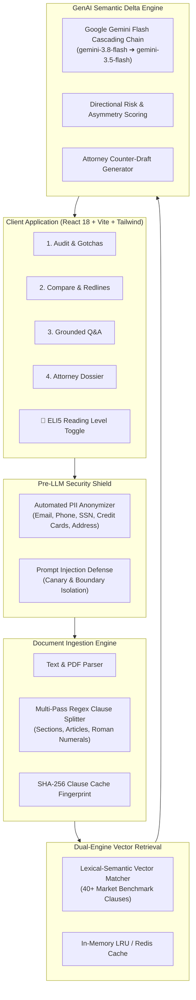

<div align="center">

# ⚖️ LexTrace AI

### *"Trace the clause. Understand the risk. Know what to ask."*

[](https://nodejs.org/)
[](https://www.typescriptlang.org/)
[](https://react.dev/)
[](https://jestjs.io/)
[]()
[](LICENSE)

**LexTrace AI** is an intelligent legal document analysis, version redlining, and attorney consultation preparation platform. Designed to eliminate contractual asymmetry, it equips freelancers, tenants, employees, and small business owners with actionable contract risk scores, hidden "gotcha" detection, grounded clause Q&A, and negotiation-ready counter-proposals.

---

</div>

## 📑 Table of Contents
- [The Problem: Contractual Asymmetry](#-the-problem-contractual-asymmetry)
- [The Solution: What LexTrace AI Does](#-the-solution-what-lextrace-ai-does)
- [System Architecture: How It Works](#-system-architecture-how-it-works)
- [Core Capabilities](#-core-capabilities)
  - [1. Persona-Adaptive Contract Risk Audit](#1-persona-adaptive-contract-risk-audit)
  - [2. Visual Redline & Semantic Divergence Engine](#2-visual-redline--semantic-divergence-engine)
  - [3. Grounded Legal Q&A Copilot](#3-grounded-legal-qa-copilot)
  - [4. Attorney Consultation Dossier & Obligation Calendar](#4-attorney-consultation-dossier--obligation-calendar)
- [Security & Privacy Standards](#-security--privacy-standards)
- [Dual-Engine Vector Architecture](#-dual-engine-vector-architecture)
- [Accessibility & Reading Levels](#-accessibility--reading-levels)
- [Technology Stack](#-technology-stack)
- [Getting Started](#-getting-started)
- [REST API Documentation](#-rest-api-documentation)
- [Automated Verification Suite](#-automated-verification-suite)
- [License & Legal Disclaimer](#-license--legal-disclaimer)

---

## 🔍 The Problem: Contractual Asymmetry

Standard-form agreements—such as freelance master services agreements, residential apartment leases, and employment contracts—are written by legal teams to protect the drafting party while shifting disproportionate risk onto the signer. Everyday individuals and small businesses routinely encounter predatory terms disguised in dense legal jargon:

- **Uncapped Unilateral Indemnification**: Forcing the signer to pay the other party's legal defense, even when the other party was negligent.
- **Perpetual Weekend IP Seizure**: Broad assignment clauses claiming ownership over personal side-projects created off-hours on personal laptops.
- **Subjective Satisfaction Payment Traps**: Granting clients the unreviewable discretion to withhold earned fees if not "completely satisfied."
- **Stealth Renewal & Notice Clauses**: 90-to-120-day advance notice cutoffs locking tenants or contractors into unwanted renewals without warning.

Non-lawyers cannot afford hundreds of dollars per hour for an attorney to review routine contracts, leaving them vulnerable to severe liabilities.

---

## 💡 The Solution: What LexTrace AI Does

LexTrace AI bridges the legal gap by breaking contracts down into structured, plain-language insights:

1. **Decomposes & Audits**: Breaks agreements into standard legal clauses, evaluates each against **40+ fair-market legal benchmarks**, and produces an **Overall Contract Health Score (0–100)**.
2. **Exposes Hidden Gotchas**: Pinpoints predatory terms in direct, plain English callouts (e.g. *"The Endless Work Trap"*, *"Paying for the Client's Mistakes"*).
3. **Generates Counter-Drafts**: Produces balanced, commercially reasonable alternative clauses with 1-click clipboard export for email negotiations.
4. **Redlines Revisions**: Visually compares competing drafts (Version 1 vs. Version 2) with word-level additions/deletions and AI semantic shift analysis.
5. **Answers Questions with Verified Citations**: Grounded conversational assistant that cites exact clause numbers, quote snippets, and confidence ratings.
6. **Prepares You for Counsel**: Compiles a 1-page **Attorney Consultation Dossier** with the top 5 high-value questions to ask an attorney, saving billable hours.

---

## 🏗️ System Architecture: How It Works

LexTrace AI uses a multi-stage pipeline designed for privacy, speed, and precision:



---

## 🚀 Core Capabilities

### 1. Persona-Adaptive Contract Risk Audit
- **Dynamic Persona Contexts**: Tailors risk weighting based on your role:
  - **Freelancer / Contractor**: Heavily weights IP ownership, payment milestones, cure periods, and liability caps.
  - **Tenant / Renter**: Heavily weights landlord entry notice, habitability guarantees, repair obligations, and security deposit return statutory windows.
  - **Employee**: Heavily weights non-compete scope, non-solicitation duration, severance terms, and invention assignments.
  - **Small Business**: Heavily weights termination for convenience, mutual liability, warranty disclaimers, and force majeure.
- **Contract Health Score (0–100)**: Clear quantitative metric indicating contract fairness.
- **"Before You Sign" Gotchas**: Highlights dangerous provisions with concrete explanations of real-world consequences.
- **1-Click Counter-Proposals**: Generates fair-market substitute language with accompanying negotiation rationales.

### 2. Visual Redline & Semantic Divergence Engine
- **Word-Level Visual Redlines**: Displays exact text differences between two contract versions with green highlights for additions and strikethrough red for removals.
- **AI Semantic Divergence Analysis**: Identifies who benefits from each change and warns signers if liability protections were quietly weakened between drafts.

### 3. Grounded Legal Q&A Copilot
- **Grounded Verification**: Answers questions strictly using the contents of the document, eliminating hallucinations.
- **Direct Clause Citations**: Every answer includes the exact clause number and a verbatim excerpt from the contract.
- **Active Document Context Switcher**: Seamlessly switch between loaded agreements or test presets directly within the chat tab.
- **Conversational Onboarding**: Welcoming assistant thread that handles general greetings (`"HI"`, `"Hello"`), introduces platform capabilities, and suggests relevant legal questions.

### 4. Attorney Consultation Dossier & Obligation Calendar
- **Top 5 High-Value Attorney Questions**: Formulates specific questions addressing unresolved ambiguities, saving hundreds of dollars during legal consultations.
- **Signer Obligation & Deadline Calendar**: Automatically extracts notice windows, cure periods, dispute cutoffs, and renewal dates into a structured timeline.
- **1-Click Export**: Export directly to Markdown or print to a formatted PDF briefing packet.

---

## 🛡️ Security & Privacy Standards

- **Automated Pre-LLM PII Anonymizer**: Detects and redacts personal identifiable information (full names, email addresses, phone numbers, Social Security Numbers, credit card numbers, and residential addresses) before any text is sent to the AI model.
- **Prompt Injection Defense**: Evaluates inputs for instruction override attempts (`"ignore previous instructions"`, `"developer mode"`), script injections, and boundary escapes.
- **Immutable Delimiter Enclosure**: Wraps contract text inside secure boundary tokens (`<<<START_LEGAL_DOC>>>`) to prevent user content from escaping the system prompt.
- **Zero Sensitive Disk Logging**: Payloads are sanitized and truncated in application logs to ensure confidential agreements are never stored in log files.
- **Strict Schema Enforcement**: All endpoints use Zod validation to ensure data integrity and reject malformed requests.

---

## ⚡ Dual-Engine Vector Architecture

- **Zero-Config In-Memory Vector Store**: The backend includes an embedded lexical-semantic cosine vector store pre-seeded with 40+ market-standard benchmark clauses. It runs instantly out-of-the-box without requiring external database installations.
- **Production PostgreSQL `pgvector` Support**: A `docker-compose.yml` configuration is provided for teams wishing to run PostgreSQL with `pgvector` and Redis in production environments.
- **SHA-256 Clause Fingerprinting**: Hashes every parsed clause to check local cache before invoking the AI model, ensuring instant response times for recurring terms.
- **Dynamic Model Failover**: Built with an automatic cascading failover chain (`gemini-3.8-flash` $\to$ `gemini-3.5-flash` $\to$ `gemini-3.6-flash` $\to$ `gemini-3.1-flash-lite`). If an endpoint experiences temporary demand spikes (503), the engine pins the active working model to keep response times under 2 seconds.

---

## ♿ Accessibility & Reading Levels

- **Reading Level Selector**:
  - **👶 ELI5 Mode (Explain Like I'm 5)**: Translates legalese into simple everyday language using relatable analogies.
  - **Standard Mode**: Clear, objective plain English for modern professionals.
  - **Legal Deep-Dive**: In-depth statutory variance and case law context for legal teams.
- **WCAG 2.1 AAA Accessibility**:
  - High-Contrast Mode toggle for visually impaired users.
  - Full semantic HTML5 structure with complete ARIA attributes and focus rings.
  - Fully navigable via keyboard controls.

---

## 🛠️ Technology Stack

| Layer | Technologies |
| :--- | :--- |
| **Frontend** | React 18, Vite, TypeScript, Tailwind CSS, Lucide React |
| **Backend API** | Node.js, Express, TypeScript, Zod, Multer, Helmet, CORS |
| **GenAI Engine** | Google Gemini Flash Generation (`@google/generative-ai`) |
| **Vector Store** | In-Memory Cosine Vector Engine (Optional: PostgreSQL + `pgvector`) |
| **Testing** | Jest, Supertest, ts-jest |

---

## 🚀 Getting Started

### Prerequisites
- [Node.js](https://nodejs.org/) (v18 or higher)
- npm or yarn

### 1. Clone the Repository
```bash
git clone https://github.com/YashYS04/LexTrace.ai.git
cd LexTrace.ai
```

### 2. Configure & Start Backend
```bash
cd backend
npm install
npm run build
npm start
```
The backend API starts on **`http://localhost:3000`**.

*(To enable live GenAI analysis, copy `.env.example` to `.env` and add your `GEMINI_API_KEY`).*

### 3. Start Frontend Dashboard
In a separate terminal:
```bash
cd frontend
npm install
npm run dev
```
Open **[http://localhost:5173](http://localhost:5173)** in your browser.

---

## 📡 REST API Documentation

| Method | Endpoint | Description |
| :--- | :--- | :--- |
| `GET` | `/api/health` | Returns service status and active AI model. |
| `GET` | `/api/documents/benchmarks` | Retrieves the 40+ market-standard legal benchmark clauses. |
| `POST` | `/api/documents/upload` | Upload `.txt` or `.pdf` file to extract plain text. |
| `POST` | `/api/documents/audit` | Audits contract text, returning health score, gotchas, and counter-drafts. |
| `POST` | `/api/documents/compare` | Compares Version 1 vs. Version 2, returning visual diffs & semantic shifts. |
| `POST` | `/api/documents/chat` | Grounded RAG conversational Q&A with verified clause citations. |
| `POST` | `/api/documents/dossier` | Generates Attorney Consultation Dossier & Obligation Calendar. |

---

## 🧪 Automated Verification Suite

The project includes **51 automated tests** across **7 test suites** validating every component:

```bash
cd backend
npm test
```

```text
PASS tests/e2e/pipeline.test.ts (5 tests)
PASS tests/integration/api.test.ts (10 tests)
PASS tests/unit/clauseSplitter.test.ts (8 tests)
PASS tests/unit/security.test.ts (13 tests)
PASS tests/unit/vectorStore.test.ts (6 tests)
PASS tests/unit/contractDiff.test.ts (4 tests)
PASS tests/unit/chatAndDossier.test.ts (3 tests)

Test Suites: 7 passed, 7 total
Tests:       51 passed, 51 total
Time:        ~4.1s
```

---

## 📄 License & Legal Disclaimer

Distributed under the **MIT License**. See `LICENSE` for details.

> **Bar Association Non-Advice Disclaimer**: *LexTrace AI is an artificial intelligence platform designed for educational and informational legal literacy. It is not an attorney or law firm and does not provide formal legal representation, legal advice, or attorney-client privilege. Always consult a licensed attorney before signing or relying upon binding legal documents.*
