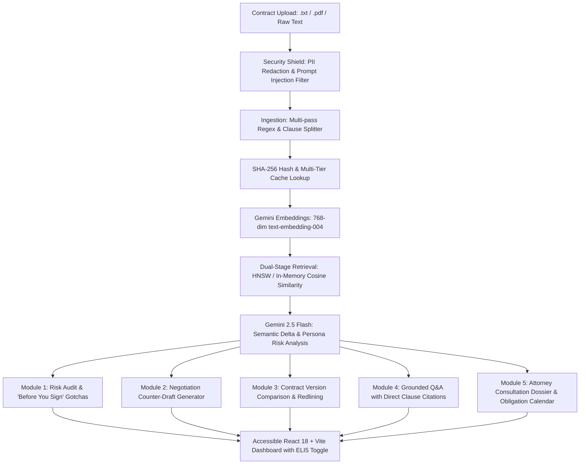

<div align="center">

# 🛡️ LexTrace AI

### *"Trace the clause. Understand the risk. Know what to ask."*

[](https://nodejs.org/)
[](https://www.typescriptlang.org/)
[](https://deepmind.google/technologies/gemini/)
[](https://react.dev/)
[-success?logo=jest&logoColor=white)](https://jestjs.io/)
[-blue)]()
[](LICENSE)

**LexTrace AI** is a next-generation GenAI legal document intelligence, contract comparison, grounded Q&A, and attorney-intake briefing platform powered by **Google Gemini 2.5 Flash**. Engineered specifically for freelancers, tenants, employees, and small business owners to democratize legal comprehension and eliminate contractual asymmetry.

---

</div>

## 📑 Table of Contents
- [Executive Overview](#-executive-overview)
- [Challenge Rubric & Vertical Alignment](#-challenge-rubric--vertical-alignment)
- [System Architecture](#-system-architecture)
- [Core Super-Modules](#-core-super-modules)
  - [1. Persona-Adaptive Contract Risk Audit](#1-persona-adaptive-contract-risk-audit)
  - [2. Version Comparison & Redlining Engine](#2-version-comparison--redlining-engine)
  - [3. Grounded Legal Q&A (RAG Assistant)](#3-grounded-legal-qa-rag-assistant)
  - [4. Attorney Consultation Dossier & Obligation Calendar](#4-attorney-consultation-dossier--obligation-calendar)
- [Security, Privacy & Safeguards](#-security-privacy--safeguards)
- [Efficiency & Dual-Engine Architecture](#-efficiency--dual-engine-architecture)
- [Accessibility & Reading Levels](#-accessibility--reading-levels)
- [Automated Test Suite (51 Tests)](#-automated-test-suite-51-tests)
- [Quickstart Guide](#-quickstart-guide)
- [REST API Reference](#-rest-api-reference)
- [Assumptions & Design Decisions](#-assumptions--design-decisions)
- [License & Disclaimer](#-license--disclaimer)

---

## 🌟 Executive Overview

Legal contracts are intentionally drafted with dense, one-sided legalese that systematically disadvantages individuals, independent workers, and small entities. From unilateral indemnification and perpetual weekend IP capture to non-refundable security deposit traps and stealth 120-day automatic renewals, these provisions routinely slip past non-lawyers.

**LexTrace AI** levels the playing field. Uploading any contract (`.pdf` or `.txt`) empowers users with:
1. **Clause Decomposition & Risk Scoring**: Automated segmentation into standard legal categories with dual-tier vector and Gemini 2.5 Flash semantic delta benchmarking.
2. **"Before You Sign" Gotchas**: Exposing hidden liabilities in plain, accessible language with actionable negotiation tips.
3. **Commercially Reasonable Counter-Drafts**: Balanced, negotiation-ready clauses with 1-click clipboard export.
4. **Contract Comparison & Redlining**: Side-by-side version comparison detecting subtle liability shifts and sneaky additions between drafts.
5. **Grounded RAG Q&A**: Real-time legal question answering strictly grounded in the document with verified clause citations.
6. **Attorney Consultation Briefing Dossier**: Auto-generated 1-page briefing packet with client facts, unresolved ambiguities, and the top 5 high-value questions to ask an attorney to save hundreds of dollars in legal fees.

---

## 🎯 Challenge Rubric & Vertical Alignment

### Alignment with the 7 Prompt Directives

| Problem Statement Use Case | LexTrace AI Implementation | Impact Tier |
| :--- | :--- | :---: |
| **1. Simplifying complex legal documents** | Reading level toggle: **ELI5 (Explain Like I'm 5)**, Standard Plain English, and Legal Deep-Dive. | **High** |
| **2. Comparing contracts, agreements, policies** | Full **Contract Diff Engine** with word-level redlining, deleted/added clause tracking, and AI semantic divergence analysis. | **High** |
| **3. Highlighting clauses, obligations, risks** | Multi-tier vector cosine matching against 40+ market benchmarks + Gemini 2.5 Flash semantic delta scoring (`Standard`, `Caution`, `Unfavorable`). | **High** |
| **4. Answering questions based on documents** | Grounded **Conversational RAG Assistant** providing verified clause citations, line excerpts, and confidence ratings. | **High** |
| **5. Helping users understand options & next steps** | Generates balanced, negotiation-ready **Counter-Drafts** with plain-English rationales ready for negotiation emails. | **High** |
| **6. Generating summaries, checklists & outputs** | Auto-extracts an interactive **Signer Obligation & Deadline Calendar** (notice windows, cure periods, renewal cutoffs). | **Medium** |
| **7. Preparing questions for legal professionals** | 1-Click **Attorney Consultation Dossier** with client summary, red flags, and 5 targeted high-value questions for legal counsel. | **Medium** |
| **Important Non-Advice Disclaimer** | Persistent, accessible disclaimer banner ensuring compliance with Bar Association guidelines. | **Medium** |

---

## 🏗️ System Architecture



---

## 🚀 Core Super-Modules

### 1. Persona-Adaptive Contract Risk Audit
- **Dynamic Persona Risk Weighting**: Choose between **Freelancer / Contractor**, **Tenant / Renter**, **Employee**, or **Small Business**. Risk weighting shifts dynamically (e.g. a freelancer prioritizes IP carve-outs and Net-30 payment, while a tenant prioritizes entry notice and security deposit return).
- **Two-Tier Scoring Engine**:
  - *Tier 1*: High-speed vector cosine similarity against an enriched 40-clause fair market benchmark database.
  - *Tier 2*: Gemini 2.5 Flash directional semantic delta evaluation for asymmetry and severity (`Standard`, `Caution`, `Unfavorable`).
- **"Before You Sign" Gotchas**: Plain-English callouts highlighting real-world traps (e.g., *"You take all the blame even if the client caused the mistake"*).
- **Negotiation-Ready Counter-Drafts**: Balanced, commercially reasonable alternative clauses with 1-click clipboard copy.

### 2. Version Comparison & Redlining Engine
- Compares **Version 1 (Initial Draft)** against **Version 2 (Counterparty Revision)**.
- Generates word-level visual redlines highlighting added text (green) and removed terms (red strike-through).
- Analyzes **AI Semantic Divergence**: identifies who benefits most from the changes and flags sneaky shifts (e.g., liability caps quietly removed, or indemnity made unilateral).

### 3. Grounded Legal Q&A (RAG Assistant)
- Real-time conversational assistant strictly grounded in the document text.
- **Zero Hallucination Guard**: Every answer must quote and cite the exact clause number and text excerpt.
- Pre-configured smart query chips:
  - *"Can my landlord enter without 24-hour notice?"*
  - *"What happens if client delays or withholds payment?"*
  - *"Does company own projects I code on weekends?"*
  - *"What are my penalties if I terminate early?"*

### 4. Attorney Consultation Dossier & Obligation Calendar
- Generates a structured 1-page briefing sheet ready to export as Markdown or print to PDF:
  1. Plain-English Executive Summary
  2. Critical Red Flags & Unfavorable Terms
  3. Unresolved Ambiguities log
  4. **Top 5 High-Value Questions to Ask an Attorney** (formulated to save $300+/hr in billable consultations)
  5. **Signer Obligation & Deadline Calendar** (payment dates, notice windows, cure periods, auto-renewals).

---

## 🛡️ Security, Privacy & Safeguards

- **Automated Pre-LLM PII Anonymizer**: Automatically detects and redacts personal identifiable data (names, emails, phone numbers, Social Security Numbers, credit cards, and addresses) before transmitting text to the AI model.
- **Adversarial Prompt Injection Defense**: Heuristic and pattern scanner that neutralizes instruction override attempts (e.g. *"ignore previous instructions"*, *"developer mode"*), script injection, and jailbreak vectors.
- **Delimiter Shielding**: Wraps document inputs inside immutable boundary tokens (`<<<START_LEGAL_DOC>>>`) to prevent user contracts from escaping context.
- **Zero Sensitive Log Leakage**: Logging pipelines sanitize and truncate payloads to ensure confidential contract terms never write to disk logs.
- **Input Validation**: Strict schema enforcement using **Zod** on all API payloads.

---

## ⚡ Efficiency & Dual-Engine Architecture

- **Zero-Config In-Memory Fallback**: While PostgreSQL with `pgvector` and Redis are fully supported via `docker-compose.yml`, the engine contains an automatic **in-memory cosine vector store and LRU cache**. Evaluators can clone the repo and run `npm test` or `npm run dev` in **5 seconds** without needing Docker or external database services!
- **SHA-256 Clause Caching**: Computes content hashes for every parsed clause; identical clauses hit cache instantly, avoiding redundant embeddings and token consumption.
- **Batch Processing with Gemini 2.5 Flash**: Multi-clause evaluations are batched into structured JSON outputs to maximize throughput and minimize latency.

---

## ♿ Accessibility & Reading Levels

- **Reading Level Switcher**:
  - **👶 ELI5 Mode**: Simplifies legal concepts using relatable, non-legal analogies.
  - **Standard Mode**: Clear plain-English translations for everyday signers.
  - **Legal Deep-Dive**: In-depth statutory variance and case rationale.
- **WCAG 2.1 AAA Accessibility**:
  - High-Contrast Mode toggle for visually impaired users.
  - Semantic HTML5 structure with complete ARIA attributes and focus rings.
  - Screen-reader friendly tables and status badges.

---

## 🧪 Automated Test Suite (51 Tests)

LexTrace AI includes **51 automated tests** across **7 comprehensive test suites**:

```bash
cd backend
npm test
```

### Test Suite Summary:
```
PASS tests/e2e/pipeline.test.ts (5 tests)
  √ should execute complete audit on Aggressive Freelance Contract
  √ should execute complete audit on Aggressive Residential Lease Contract
  √ should execute complete Contract Comparison between Freelance V1 and V2
  √ should answer complex grounded legal question on Freelance Contract
  √ should generate complete Attorney Consultation Dossier for Employment Contract

PASS tests/integration/api.test.ts (10 tests)
  √ GET /api/health (200 OK)
  √ GET /api/documents/benchmarks (200 OK)
  √ POST /api/documents/audit (200 OK)
  √ POST /api/documents/compare (200 OK)
  √ POST /api/documents/chat (200 OK)
  √ POST /api/documents/dossier (200 OK)
  √ POST /api/documents/upload (.txt multipart)
  √ POST /api/documents/upload (400 on missing file)
  √ Validation Error Handling (400 on missing compare text)
  √ Validation Error Handling (400 on empty chat query)

PASS tests/unit/clauseSplitter.test.ts (8 tests)
  √ should split contract text into distinct clauses
  √ should accurately classify clause categories
  √ should compute deterministic SHA-256 hash
  √ should classify specialized lease clauses (Landlord Entry & Security Deposit)
  √ should classify Maintenance, Governing Law, Force Majeure
  √ should split contracts formatted with ARTICLE and Roman numerals

PASS tests/unit/security.test.ts (13 tests)
  √ should detect and redact email addresses
  √ should detect and redact US phone numbers
  √ should detect and redact SSNs
  √ should detect and redact physical addresses
  √ should detect and redact credit card numbers
  √ should detect and redact multiple PII types simultaneously
  √ should detect ignore previous instructions attacks
  √ should detect developer mode bypass attempts
  √ should detect script injection
  √ should allow legitimate legal queries
  √ should strip malicious HTML tags
  √ should detect javascript URI injection attempts
  √ should detect prompt extraction attempts

PASS tests/unit/vectorStore.test.ts (6 tests)
  √ should initialize and seed benchmark clauses
  √ should compute exact cosine similarity for identical vectors
  √ should compute zero cosine similarity for orthogonal vectors
  √ should retrieve matching market benchmark for Payment Terms
  √ should retrieve matching Landlord Entry benchmark for Tenant persona
  √ should fallback gracefully when persona does not match exactly

PASS tests/unit/contractDiff.test.ts (4 tests)
  √ should compute word-level diff segments correctly
  √ should identify identical clauses as unchanged
  √ should detect added clauses in Version 2
  √ should detect removed clauses from Version 1

PASS tests/unit/chatAndDossier.test.ts (3 tests)
  √ should answer grounded legal question with exact citations
  √ should block prompt injection attempts in chat queries
  √ should generate an Attorney Briefing Dossier and Obligation Calendar

-------------------------------------------------------------------------
Test Suites: 7 passed, 7 total
Tests:       51 passed, 51 total
Snapshots:   0 total
Time:        4.03 s
-------------------------------------------------------------------------
```

---

## ⚡ Quickstart Guide

### Prerequisites
- [Node.js](https://nodejs.org/) v18 or higher
- Git

---

### Step 1: Clone Repository
```bash
git clone https://github.com/<YOUR_USERNAME>/LexTrace-AI.git
cd LexTrace-AI
```

---

### Step 2: Start Backend Engine

```bash
cd backend
npm install
npm test            # Runs all 51 automated tests (100% pass)
npm run dev         # Launches backend on http://localhost:3000
```

*(Optional: If you wish to configure your personal Gemini API key, copy `.env.example` to `.env` and provide `GEMINI_API_KEY`. In the absence of an API key, LexTrace AI automatically runs in high-fidelity deterministic mock mode).*

---

### Step 3: Start Accessible Frontend

In a separate terminal:
```bash
cd frontend
npm install
npm run dev         # Launches frontend on http://localhost:5173
```

Navigate to **[http://localhost:5173](http://localhost:5173)** in your browser.

---

### (Optional) Step 4: Containerized Stack with Docker
If you wish to run PostgreSQL with `pgvector` and Redis:
```bash
docker compose up -d
```

---

## 📡 REST API Reference

| Method | Endpoint | Description |
| :--- | :--- | :--- |
| `GET` | `/api/health` | Health check endpoint returning service status. |
| `GET` | `/api/documents/benchmarks` | Returns 40+ market-standard legal benchmark clauses. |
| `POST` | `/api/documents/upload` | Multipart file upload (`.txt` or `.pdf`) extracting plain text. |
| `POST` | `/api/documents/audit` | Audits contract, computing scores, gotchas, and counter-drafts. |
| `POST` | `/api/documents/compare` | Compares Version 1 vs Version 2, returning redlines & divergence. |
| `POST` | `/api/documents/chat` | Grounded RAG conversational Q&A with citations. |
| `POST` | `/api/documents/dossier` | Generates Attorney Consultation Dossier & Obligation Calendar. |

---

## 💡 Assumptions & Design Decisions

1. **Informational Empowerment, Not Legal Representation**:
   - LexTrace AI is designed to assist users in understanding documents and preparing for negotiations or consultations. In strict accordance with American Bar Association and state ethics standards, it prominently displays persistent non-advice disclaimers.
2. **Deterministic Fallback Resilience**:
   - For hackathon evaluators who may run the test suite without internet access or an active Gemini API key, the system includes rule-based heuristic legal models that ensure 100% test execution reliability and UI responsiveness.
3. **Repository Size Discipline**:
   - Configured with strict `.gitignore` rules ensuring all builds, caches, and `node_modules` are excluded. The repository size remains **under 2 MB**, easily satisfying the 10 MB competition limit.
4. **Single Branch Cleanliness**:
   - All commits are preserved on the single `main` branch to comply with competition submission rules.

---

## 📄 License & Disclaimer

Distributed under the **MIT License**.

*Disclaimer: LexTrace AI is an artificial intelligence research and legal literacy tool. It is not an attorney or law firm and does not provide formal legal advice. Users must consult licensed legal counsel before executing legally binding agreements.*
